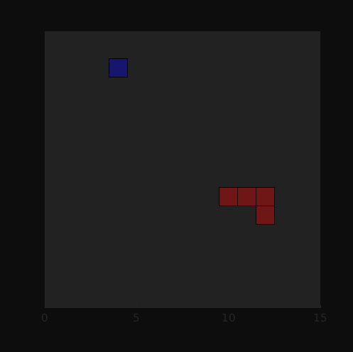

# 2D Snake game neural network using Matlab r2019b


This project creates a snake trained by a neural network reinforcement learning algorithm. In this game, the snake tries to eat as much food as possible without hitting the boundaries of the box. The neural network has sixteen input neurons, and four output neurons. To make the project more simple, I currently do not feature a tail on the snake. There are 8 directions the snake looks at any given time: (North,Northeast,East,Southeast,South,Southwest,West,and Northwest). The inputs are the distances to food and distances to a wall if applicable for any given direction it looks in, else the value is a -1. While training the algorithm, a progress graph will display the effectiveness of the training. A simulation of the snake also diplays in a figure to help visualize what the neural network is "thinking" while training.

## Getting Started

Helpful hints to help jumpstart your project.

### Prerequisites

You will need the latest version of Matlab, in addition to some toolboxes

```
Matlab r2019b, Deep Learning, Reinforcement learning toolboxes
```

### Start up Matlab

Load the files into matlab, and ensure they are all in the working directory

If you want to train your own network, leave the code as is. If not, set doTraining to false on line 98. This will load a pre-trained agent to simulate.

```
doTraining = false;
```
If you want to utilize most of your cpu cores while training, uncomment the following lines(92-95).


```
trainOpts.UseParallel = true;
trainOpts.ParallelizationOptions.Mode = "async";
trainOpts.ParallelizationOptions.DataToSendFromWorkers = "gradients";
trainOpts.ParallelizationOptions.StepsUntilDataIsSent = 32;
```

## Troubleshooting the algorithm

There are many ways to adjust the outcome of a neural network training function

### Adjust the reward function

Tinkering with the values of rewards/penalties help "guide" the snake toward the end goal. This can be done by modifying the reward function on line 152 in the snake_env.m file.

```
if ~done
   reward = food_reward + proximity;
else
   reward = food_reward -10;

   % if the snake has eaten more than 1 food, display how many foods it has eaten in the command line
   if indicator > 0
   X = ['Snake got ',num2str(indicator),' food!'];
   disp(X)
   end
end
```
### Adjust the layers of the neural network
Do this by modifying the snake_main.m file. For instance, if you wanted to modify the layers in the critic network, modify this block of code:

```
criticNetwork = [
    imageInputLayer([numObservations 1 1],'Normalization','none','Name','state')
    fullyConnectedLayer(32,'Name','CriticStateFC1')
    reluLayer('Name','CriticRelu1')
    fullyConnectedLayer(32,'Name','CriticStateFC2')
    reluLayer('Name','CriticRelu2')
    fullyConnectedLayer(32,'Name','CriticStateFC3')
    reluLayer('Name','CriticRelu3')
    fullyConnectedLayer(1, 'Name', 'CriticFC')];
```
You can change the amount of layers and nodes in a network this way. If you want to explore new layers, type "doc layer" for a more in depth explanation.

## License

This project is licensed under the MIT License - see the [LICENSE.md](LICENSE.md) file for details

